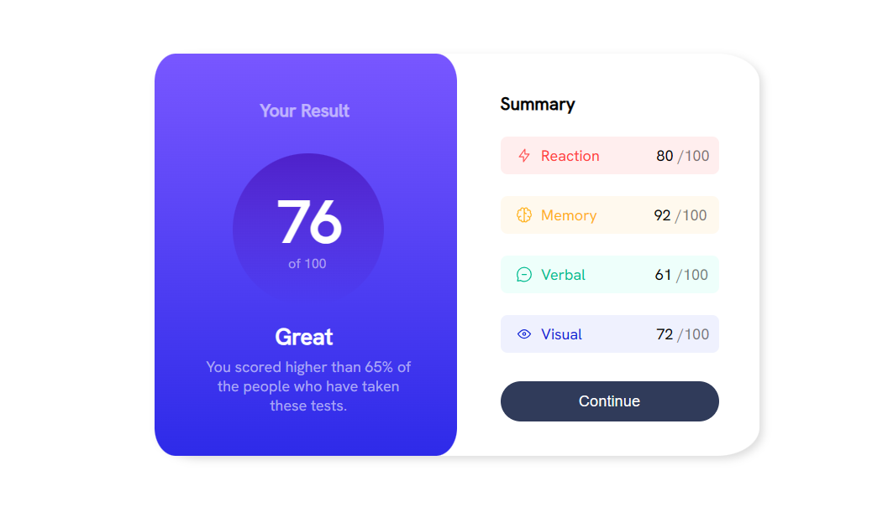
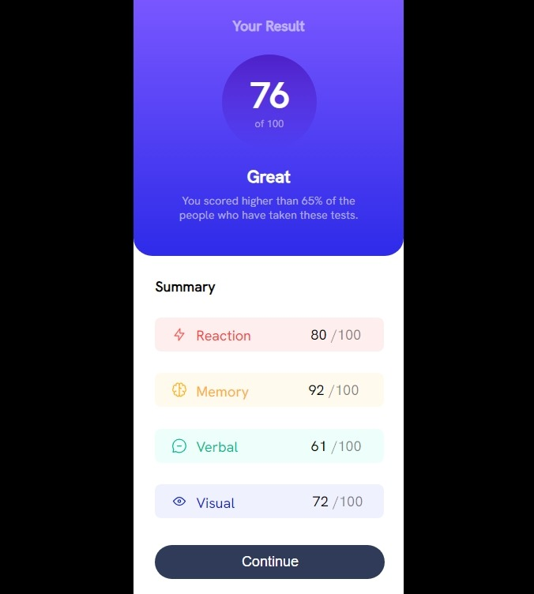

# Frontend Mentor - Results summary component solution

This is a solution to the [Results summary component challenge on Frontend Mentor](https://www.frontendmentor.io/challenges/results-summary-component-CE_K6s0maV). Frontend Mentor challenges help you improve your coding skills by building realistic projects. 

## Table of contents

- [Overview](#overview)
  - [The challenge](#the-challenge)
  - [Screenshots](#screenshots)
  - [Links](#links)
- [My process](#my-process)
  - [Built with](#built-with)
- [Author](#author)

## Overview

This was an awesome way to revise my knowledge of HTML and CSS. I almost gave up but after going through with it I feel motivated. There was no challenge but it was helpful.

### The challenge

Users should be able to:

- View the optimal layout for the interface depending on their device's screen size
- See hover and focus states for all interactive elements on the page

### Screenshots

### Links

- Solution URL: [Add solution URL here](https://your-solution-url.com)

## My process

Started by looking at the design and breaking it down into HTML stracture then moving on to working with the css by planning on how to apply flex and which areas to apply it. The breaking down of the design into HTML tags was first done on paper before typing out the HTML and the after the CSS was added.

### Built with

- Semantic HTML5 markup
- CSS
- Flexbox

## Author
- Frontend Mentor - [@MichealWordCode](https://www.frontendmentor.io/profile/MichealWordCode)
- Twitter - [@alphastand27](https://www.twitter.com/alphastand27)
